<table>
<tr>
<td width="50%">
<picture>
  <source media="(prefers-color-scheme: dark)" srcset="assets/signal-dark.svg">
  <source media="(prefers-color-scheme: light)" srcset="assets/signal-light.svg">
  
</picture>
</td>
<td width="50%">
<picture>
  <source media="(prefers-color-scheme: dark)" srcset="assets/rhythm-dark.svg">
  <source media="(prefers-color-scheme: light)" srcset="assets/rhythm-light.svg">
  
</picture>
</td>
</tr>
</table>

<picture>
  <source media="(prefers-color-scheme: dark)" srcset="assets/constellation-dark.svg">
  <source media="(prefers-color-scheme: light)" srcset="assets/constellation-light.svg">
  
</picture>

<table>
<tr>
<td width="50%">
<picture>
  <source media="(prefers-color-scheme: dark)" srcset="assets/cadence-dark.svg">
  <source media="(prefers-color-scheme: light)" srcset="assets/cadence-light.svg">
  
</picture>
</td>
<td width="50%">
<picture>
  <source media="(prefers-color-scheme: dark)" srcset="assets/flagship-dark.svg">
  <source media="(prefers-color-scheme: light)" srcset="assets/flagship-light.svg">
  
</picture>
</td>
</tr>
</table>

语言光谱按**仓库主语言计数**而非代码字节数——字节数只说明谁提交了更大的生成物。星图纵轴是 star 的对数刻度，发布节奏用平方根刻度，否则每日快照的那个月会把其余月份压平。

<picture>
  <source media="(prefers-color-scheme: dark)" srcset="assets/divider-dark.svg">
  <source media="(prefers-color-scheme: light)" srcset="assets/divider-light.svg">
  
</picture>

### 作品账本

<!--START:ledger-->
| 仓库 | 语言 | Stars | Forks | 最近推送 | 一句话 |
|:--|:--|--:|--:|:--|:--|
| [HyperADRules](https://github.com/Lynricsy/HyperADRules) | Python | 287 | 11 | 2026-09-04 | HyperADRules — 下一代广告/恶意域名规则聚合；多… |
| [MyOI](https://github.com/Lynricsy/MyOI) | C++ | 113 | 0 | 2021-09-02 | My OI Code for OI learners. |
| [OneSSH](https://github.com/Lynricsy/OneSSH) | Go | 85 | 16 | 2026-09-04 | 面向 AI Agent 的集中式 SSH 网关，提供 MCP … |
| [Ollama2OpenAI](https://github.com/Lynricsy/Ollama2OpenAI) | HTML | 26 | 4 | 2025-06-20 | Convert Ollama format requests … |
| [AC-Updater](https://github.com/Lynricsy/AC-Updater) | Python | 5 | 0 | 2021-01-14 | A Data Updater For Arknights-Ch… |
| [AgentLogs](https://github.com/Lynricsy/AgentLogs) | JavaScript | 4 | 0 | 2026-08-10 | 一个简单的AI记录和查找工作日志的MCP工具 |
| [Arianna](https://github.com/Lynricsy/Arianna) | Python | 4 | 1 | 2024-10-17 | GalGame. Redifined with GenAI. |
| [OneIndex](https://github.com/Lynricsy/OneIndex) | TypeScript | 4 | 2 | 2022-11-12 | — |
<!--END:ledger-->

### 最近动态

<!--START:launches-->
<table>
<tr>
<td valign="top" width="50%">

**🚀 最近发布**

- **[AdRulesUltra](https://github.com/Lynricsy/AdRulesUltra)** [`snapshot-20260904`](https://github.com/Lynricsy/AdRulesUltra/releases/tag/snapshot-20260904) — 2026-09-04 · 46 artifacts
- **[HyperADRules](https://github.com/Lynricsy/HyperADRules)** [`snapshot-20260904`](https://github.com/Lynricsy/HyperADRules/releases/tag/snapshot-20260904) — 2026-09-04 · 46 artifacts
- **[OneSSH](https://github.com/Lynricsy/OneSSH)** [`v0.1.16`](https://github.com/Lynricsy/OneSSH/releases/tag/v0.1.16) — 2026-09-03 · 9 artifacts
- **[AgentConfigHub](https://github.com/Lynricsy/AgentConfigHub)** [`v0.2.2`](https://github.com/Lynricsy/AgentConfigHub/releases/tag/v0.2.2) — 2026-08-15
- **[WanxiangExtra](https://github.com/Lynricsy/WanxiangExtra)** [`latest`](https://github.com/Lynricsy/WanxiangExtra/releases/tag/latest) — 2026-08-13 · 5 artifacts

</td>
<td valign="top" width="50%">

**⚡ 最近推进**

- **[AdRulesUltra](https://github.com/Lynricsy/AdRulesUltra)** — 2026-09-04 · Python
- **[HyperADRules](https://github.com/Lynricsy/HyperADRules)** — 2026-09-04 · Python
- **[OneSSH](https://github.com/Lynricsy/OneSSH)** — 2026-09-04 · Go
- **[WanxiangExtra](https://github.com/Lynricsy/WanxiangExtra)** — 2026-09-02 · Python
- **[ThoTieBash](https://github.com/Lynricsy/ThoTieBash)** — 2026-09-01 · Python

</td>
</tr>
</table>
<!--END:launches-->

更多统计（语言与时段分布，第三方服务）

这两张来自第三方服务，会有缓存延迟；上面的自产卡片才是权威数据。

<picture>
  <source media="(prefers-color-scheme: dark)" srcset="assets/footer-dark.svg">
  <source media="(prefers-color-scheme: light)" srcset="assets/footer-light.svg">
  
</picture>

<!--START:stamp-->
`最后同步 2026-09-05 · 75 repos · 541 stars · 7,554 contributions/12m`
<!--END:stamp-->

