<div align="center">

<picture>
  <source media="(prefers-color-scheme: dark)" srcset="assets/hero-dark.svg">
  <source media="(prefers-color-scheme: light)" srcset="assets/hero-light.svg">
  
</picture>

<p>
  <a href="https://xn--866a.com/"></a>
  <a href="https://github.com/Lynricsy?tab=repositories"></a>
  <a href="https://github.com/Lynricsy?tab=followers"></a>
  <a href="https://github.com/Lynricsy/HyperADRules/releases/latest"></a>
  
</p>

</div>

哈尔滨工业大学本科在读。做三件事：把 AI Agent 需要的基础设施做成**可审计**的系统，把公开的网络规则数据做成**每天可复现**的流水线，以及从竞赛算法里带出来的那点对细节的偏执。

这个页面上的所有数据卡都由本仓库的 [`scripts/build-profile.mjs`](scripts/build-profile.mjs) 每天自产 —— 不依赖任何会突然 402/503 的公共卡片服务。

---

<table>
<tr>
<td width="33.3%" valign="top">

<b>◤ AGENT INFRA</b><br>
<sub>让 Agent 拿到能力，但拿不到钥匙</sub><br><br>
<a href="https://github.com/Lynricsy/OneSSH"><b>OneSSH</b></a> · Go<br>
<sub>集中式 SSH 网关：MCP 接入、凭据托管、细粒度授权、全程审计</sub><br><br>
<a href="https://github.com/Lynricsy/AgentConfigHub"><b>AgentConfigHub</b></a> · TypeScript<br>
<sub>自托管控制面，统一版本化并分发各家 Agent 的配置</sub><br><br>
<a href="https://github.com/Lynricsy/AgentLogs"><b>AgentLogs</b></a> · JavaScript<br>
<sub>MCP 工作日志：可检索的“为什么这么做”</sub>

</td>
<td width="33.3%" valign="top">

<b>◤ NETWORK RULES</b><br>
<sub>把上游噪音编译成可用产物</sub><br><br>
<a href="https://github.com/Lynricsy/HyperADRules"><b>HyperADRules</b></a> · Python<br>
<sub>多上游合并去重，一次构建输出 mihomo MRS / sing-box SRS / Clash / AdGuard 等格式</sub><br><br>
<a href="https://github.com/Lynricsy/Ollama2OpenAI"><b>Ollama2OpenAI</b></a><br>
<sub>把 Ollama 协议翻译成 OpenAI 协议的适配层</sub><br><br>
<a href="https://github.com/Lynricsy/SurgeRuleEx"><b>SurgeRuleEx</b></a><br>
<sub>Surge 规则集补丁</sub>

</td>
<td width="33.3%" valign="top">

<b>◤ ALGORITHM &amp; PLAYGROUND</b><br>
<sub>手感是训练出来的</sub><br><br>
<a href="https://github.com/Lynricsy/MyOI"><b>MyOI</b></a> · C++<br>
<sub>竞赛代码与题解，给同样在啃 OI 的人</sub><br><br>
<a href="https://github.com/Lynricsy/Arianna"><b>Arianna</b></a> · Python<br>
<sub>用生成式模型重新定义 GalGame 的叙事结构</sub><br><br>
<a href="https://github.com/Lynricsy/Pixora"><b>Pixora</b></a> · Go<br>
<sub>图像处理实验场</sub>

</td>
</tr>
</table>

---

### 一次握手长什么样

<div align="center">
<picture>
  <source media="(prefers-color-scheme: dark)" srcset="assets/handshake-dark.svg">
  <source media="(prefers-color-scheme: light)" srcset="assets/handshake-light.svg">
  
</picture>
</div>

> 这是**架构快照**，不是线上状态面板：每一行对应 OneSSH 公开的设计约束，不代表任何真实主机的在线情况。凭据永远留在网关，模型只拿到被授权的动作。

---

### 数据面板

<table>
<tr>
<td width="50%">
<picture>
  <source media="(prefers-color-scheme: dark)" srcset="assets/signal-dark.svg">
  <source media="(prefers-color-scheme: light)" srcset="assets/signal-light.svg">
  
</picture>
</td>
<td width="50%">
<picture>
  <source media="(prefers-color-scheme: dark)" srcset="assets/pulse-dark.svg">
  <source media="(prefers-color-scheme: light)" srcset="assets/pulse-light.svg">
  
</picture>
</td>
</tr>
</table>

<sub>左卡的语言光谱按**自有仓库的主语言计数**统计，不按代码字节数 —— 字节数只会告诉你谁提交了更大的生成物。</sub>

---

### 作品账本

<!--START:ledger-->
| 仓库 | 语言 | Stars | Forks | 最近推送 |
|:--|:--|--:|--:|:--|
| [HyperADRules](https://github.com/Lynricsy/HyperADRules) | Python | 282 | 12 | 2026-08-25 |
| [MyOI](https://github.com/Lynricsy/MyOI) | C++ | 113 | 0 | 2021-09-02 |
| [OneSSH](https://github.com/Lynricsy/OneSSH) | Go | 68 | 15 | 2026-08-26 |
| [Ollama2OpenAI](https://github.com/Lynricsy/Ollama2OpenAI) | HTML | 26 | 4 | 2025-06-20 |
| [AC-Updater](https://github.com/Lynricsy/AC-Updater) | Python | 5 | 0 | 2021-01-14 |
| [AgentLogs](https://github.com/Lynricsy/AgentLogs) | JavaScript | 4 | 0 | 2026-08-10 |
<!--END:ledger-->

<details>
<summary>HyperADRules 的 star 曲线</summary>


</details>

---

### 最近动态

<!--START:launches-->
<table>
<tr>
<td valign="top" width="50%">

**🚀 最近发布**

- **[HyperADRules](https://github.com/Lynricsy/HyperADRules)** [`snapshot-20260825`](https://github.com/Lynricsy/HyperADRules/releases/tag/snapshot-20260825) — 2026-08-25 · 46 artifacts
- **[OneSSH](https://github.com/Lynricsy/OneSSH)** [`v0.1.13`](https://github.com/Lynricsy/OneSSH/releases/tag/v0.1.13) — 2026-08-20 · 9 artifacts
- **[AgentConfigHub](https://github.com/Lynricsy/AgentConfigHub)** [`v0.2.2`](https://github.com/Lynricsy/AgentConfigHub/releases/tag/v0.2.2) — 2026-08-15
- **[WanxiangExtra](https://github.com/Lynricsy/WanxiangExtra)** [`latest`](https://github.com/Lynricsy/WanxiangExtra/releases/tag/latest) — 2026-08-13 · 5 artifacts
- **[AgentLogs](https://github.com/Lynricsy/AgentLogs)** [`v2.0.1`](https://github.com/Lynricsy/AgentLogs/releases/tag/v2.0.1) — 2026-08-10

</td>
<td valign="top" width="50%">

**⚡ 最近推进**

- **[OneSSH](https://github.com/Lynricsy/OneSSH)** — 2026-08-26 · Go
- **[AdRulesUltra](https://github.com/Lynricsy/AdRulesUltra)** — 2026-08-25 · Python
- **[HyperADRules](https://github.com/Lynricsy/HyperADRules)** — 2026-08-25 · Python
- **[AgentLoom](https://github.com/Lynricsy/AgentLoom)** — 2026-08-25 · TypeScript
- **[WanxiangExtra](https://github.com/Lynricsy/WanxiangExtra)** — 2026-08-24 · Python

</td>
</tr>
</table>
<!--END:launches-->

---

### 一题一音

> 30 秒题｜不用循环、不用 `__builtin_popcount`，只靠 `+ - & | ^ >>` 和常数，怎么算 32 位整数里有多少个 1？

<details>
<summary>看答案（SWAR，4 行）</summary>

```c
uint32_t popcount(uint32_t x) {
    x -= (x >> 1) & 0x55555555u;                       // 每 2 位存本段的 1 的个数
    x = (x & 0x33333333u) + ((x >> 2) & 0x33333333u);   // 合并成每 4 位一段
    x = (x + (x >> 4)) & 0x0f0f0f0fu;                   // 合并成每 8 位一段
    return (x * 0x01010101u) >> 24;                     // 一次乘法把 4 个字节加到最高字节
}
```

关键在最后一步：乘 `0x01010101` 等价于把四个字节错位相加，结果的最高字节正好是总和 —— 前提是每段的值都 ≤ 15，所以第三行的掩码不能省。

</details>

有更快的写法或者更漂亮的证明？[开个 issue 告诉我](https://github.com/Lynricsy/Lynricsy/issues/new?title=%E4%B8%80%E9%A2%98%E4%B8%80%E9%9F%B3%EF%BC%9Apopcount&body=%E6%88%91%E7%9A%84%E5%86%99%E6%B3%95%EF%BC%9A%0A%0A%60%60%60c%0A%0A%60%60%60%0A%0A%E4%B8%BA%E4%BB%80%E4%B9%88%E6%9B%B4%E5%A5%BD%EF%BC%9A%0A)。

---

### 顺手的工具

<div align="center">

</div>

<details>
<summary>更多统计（语言与时段分布）</summary>

<div align="center">


</div>

<sub>这两张来自第三方服务，会有缓存延迟；上面的自产卡片才是权威数据。</sub>

</details>

---

<div align="center">
<!--START:stamp-->
`最后同步 2026-08-26 · 75 repos · 519 stars`
<!--END:stamp-->
</div>
